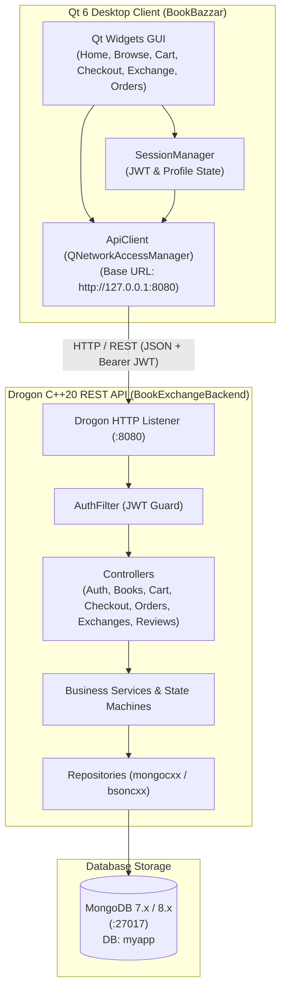

# BookBazzar — Peer-to-Peer Book Marketplace & Exchange Platform

[](https://en.wikipedia.org/wiki/C%2B%2B20)
[](https://www.qt.io/)
[](https://github.com/drogonframework/drogon)
[](https://www.mongodb.com/)
[](https://cmake.org/)
[](LICENSE)

An end-to-end, high-performance C++ peer-to-peer book marketplace and direct barter exchange platform. **BookBazzar** enables college students and book enthusiasts to purchase pre-owned books, sell their personal collection, or atomically swap books directly with peers without monetary transactions.

---

## 1. What We Provide

BookBazzar is engineered as a production-grade full-stack C++ application combining a modern asynchronous REST API backend with an intuitive, native desktop graphical interface:

### 🛒 1. Cash-Based Marketplace (Buy & Sell)
- **Book Discovery & Search**: Fast text search across titles, authors, and ISBNs with dynamic filters for condition (`New`, `Like New`, `Very Good`, `Good`, `Acceptable`), category, and price range.
- **Form-Driven Selling**: Sellers can list books with real cover photos, detailed descriptions, condition tags, and custom pricing.
- **Persistent Shopping Cart**: Real-time server-synced cart with single-copy inventory clamping and automatic stale-item detection if another buyer checks out first.
- **Atomic Checkout & Simulated Payments**: Race-condition-free purchase locking preventing double-buys; simulated instant payments (`UPI`, `CARD`, `COD`) with ₹0 shipping.

### 🔄 2. Direct Peer-to-Peer Barter Book Exchange
- **Zero-Money Book Swapping**: Propose swapping any book you own for another user's listing.
- **Two-Sided Atomic Ownership Transfer**: When the recipient accepts an exchange, book ownership is atomically transferred in MongoDB, listings are removed from public search, and transaction histories are logged.
- **Conflict Prevention**: If a book proposed for exchange is concurrently sold in the marketplace, the exchange is cleanly aborted to ensure data consistency.

### 📦 3. Post-Purchase Fulfillment, Returns & Cancellations
- **Delivery Lifecycle Tracking**: Live progression from `PLACED` → `CONFIRMED` → `PACKED` → `SHIPPED` → `OUT_FOR_DELIVERY` → `DELIVERED` with tracking numbers.
- **Pre-Shipment Cancellation**: Buyers can cancel orders before dispatch to receive instant simulated refunds and immediately restore physical book availability.
- **Post-Delivery Return Flow**: Buyers can request returns with structured reasons; sellers can approve or reject return requests.

### ⭐ 4. Verified Purchase Ratings & Reviews
- **Verified Buyers Only**: Reviews can only be submitted after an order has reached `DELIVERED` status.
- **Real-Time Aggregate Ratings**: Dynamic calculation of average ratings (1 to 5 stars) and review counts for every listing.
- **Privacy Controls**: Public review streams preserve buyer privacy by scrubbing sensitive order and payment metadata.

### 🔒 5. Production-Grade Security
- **Argon2id Password Hashing**: State-of-the-art memory-hard hashing with OpenSSL CSPRNG cryptographic salting.
- **Dual-Token Authentication**: Short-lived HS256 JWT access tokens paired with rotating SHA-256 refresh tokens.
- **In-Depth IDOR Authorization**: Strict server-side ownership verification preventing unauthorized updates or deletions.

---

## 2. System Architecture



---

## 3. Repository Structure

```
.
├── backend/                        # C++20 Drogon REST API Backend
│   ├── CMakeLists.txt              # vcpkg-integrated build configuration
│   ├── vcpkg.json                  # Manifest (drogon, mongocxx, argon2, jwt-cpp)
│   ├── config.json                 # Drogon server listener & thread settings
│   ├── start_server.ps1            # Helper script to start backend server
│   ├── include/                    # Public C++ headers
│   │   ├── config/AppConfig.h      # Environment & configuration loader
│   │   ├── db/MongoDatabase.h      # MongoDB connection manager & indexes
│   │   ├── controllers/            # Drogon REST controllers
│   │   ├── models/                 # Domain structs (Book, User, Cart, Order, etc.)
│   │   ├── repositories/           # Mongo data access layer
│   │   ├── security/               # Argon2id, JWT, and Payment services
│   │   └── services/               # Core business orchestration
│   ├── src/                        # Implementations matching include/
│   └── tests/                      # Automated test scripts (91 QA integration tests)
│
├── frontend/                       # Qt6 Desktop Client GUI
│   ├── CMakeLists.txt              # Qt6 CMake build configuration
│   ├── include/                    # C++ headers
│   │   ├── auth/SessionManager.h   # In-memory JWT and user state
│   │   ├── models/DataModels.h     # Client domain models & JSON parsers
│   │   ├── network/ApiClient.h     # Asynchronous REST HTTP client
│   │   ├── windows/                # Window classes (Cart, Checkout, Orders, etc.)
│   │   └── ...                     # Core GUI headers
│   ├── src/                        # GUI implementations matching include/
│   ├── tests/                      # Qt6::Test unit and contract test suites
│   └── ui/                         # Qt Designer UI forms
│
└── README.md                       # Master project overview
```

---

## 4. Tech Stack

| Domain | Technology | Version | Purpose |
| :--- | :--- | :---: | :--- |
| **Backend Core** | C++ | ISO C++20 | REST API business logic & data operations |
| **Backend Framework** | [Drogon](https://github.com/drogonframework/drogon) | 1.9.x | High-throughput asynchronous HTTP REST server |
| **Database** | MongoDB | 7.x / 8.x | Document database using `mongocxx` 3.10+ |
| **Desktop Client** | Qt Widgets | Qt 6.x / Qt 5.x | Cross-platform responsive desktop GUI |
| **Security & Cryptography** | Argon2 + OpenSSL | Argon2id / 3.x | Password hashing and cryptographic token generation |
| **Authentication** | [jwt-cpp](https://github.com/Thalhammer/jwt-cpp) | 0.7.x | HS256 JSON Web Token encode and decode |
| **JSON Serialization** | JsonCpp / QJsonDocument | 1.9.x / Qt 6 | High-speed JSON serialization |
| **Package Management** | vcpkg | Manifest Mode | Backend C++ library acquisition |
| **Build System** | CMake | ≥ 3.20 | Multi-platform compilation system |

---

## 5. Quick Start Guide

### Prerequisites
- **Operating System**: Windows 10/11, Linux, or macOS
- **Compiler**: Visual Studio 2022 (MSVC with C++20), GCC 11+, or Clang 13+
- **CMake**: Version 3.20 or newer
- **Qt**: Qt 6.x installed with Widgets, Network, and Sql modules
- **MongoDB**: Community Server installed locally and listening on port `27017`
- **vcpkg**: Installed for C++ backend dependency resolution

---

### Step 1: Start MongoDB
Ensure MongoDB is running on `127.0.0.1:27017`. If using local storage within this repository:
```powershell
& "C:\Program Files\MongoDB\Server\8.3\bin\mongod.exe" --dbpath "mongodb_data" --bind_ip 127.0.0.1 --port 27017
```

---

### Step 2: Build & Start the Backend Server

```powershell
# Navigate to backend directory
cd backend

# Build with CMake & vcpkg
cmake -B build -S . -DCMAKE_TOOLCHAIN_FILE=C:/dev/vcpkg/scripts/buildsystems/vcpkg.cmake
cmake --build build --config Debug

# Start the server (uses start_server.ps1 helper)
.\start_server.ps1
```
The REST API server will begin listening on **`http://127.0.0.1:8080`**.

---

### Step 3: Build & Launch the Qt Desktop Frontend

Open the `frontend/` directory in **Qt Creator** or build via terminal:

```powershell
# Navigate to frontend directory
cd frontend

# Configure and compile
cmake -B build -S .
cmake --build build --config Debug

# Run BookBazzar
.\build\Debug\BookBazzar.exe
```

---

## 6. REST API Overview

All protected endpoints require an `Authorization: Bearer <jwt>` HTTP header.

| Method | Route | Auth | Description |
| :--- | :--- | :---: | :--- |
| `POST` | `/api/auth/register` | None | Register a new user account |
| `POST` | `/api/auth/login` | None | Authenticate credentials and receive JWT |
| `GET` | `/api/auth/me` | Bearer | Retrieve authenticated user profile |
| `GET` | `/api/books` | None | Search & browse available listings (paginated) |
| `GET` | `/api/books/:id` | None | Get comprehensive book details & reviews summary |
| `POST` | `/api/books` | Bearer | Create a new physical book listing |
| `PUT` | `/api/books/:id` | Bearer | Update an owned book listing |
| `DELETE` | `/api/books/:id` | Bearer | Delist / remove an owned book |
| `GET` | `/api/cart` | Bearer | Fetch persistent cart & check for stale items |
| `POST` | `/api/cart/items` | Bearer | Add book to cart (single-copy quantity guaranteed) |
| `DELETE` | `/api/cart/items/:id` | Bearer | Evict item from cart |
| `POST` | `/api/checkout` | Bearer | Atomic checkout, inventory lock & demo payment |
| `GET` | `/api/orders` | Bearer | List buyer orders & seller fulfillment history |
| `GET` | `/api/orders/:id` | Bearer | Get full order lifecycle, tracking and item details |
| `PATCH` | `/api/orders/:id/status`| Bearer | Advance delivery status (seller only) |
| `POST` | `/api/orders/:id/cancel`| Bearer | Pre-shipping order cancellation & inventory refund |
| `POST` | `/api/orders/:id/return`| Bearer | Request post-delivery item return |
| `POST` | `/api/exchanges` | Bearer | Propose barter exchange (offering owned book for requested book) |
| `GET` | `/api/exchanges/sent` | Bearer | View sent barter proposals |
| `GET` | `/api/exchanges/received`| Bearer | View received barter proposals |
| `POST` | `/api/exchanges/:id/accept`| Bearer | Accept exchange & trigger atomic two-sided ownership swap |
| `POST` | `/api/reviews` | Bearer | Submit rating and review for delivered book |
| `GET` | `/api/reviews/book/:id` | None | View public verified reviews for a book |

For complete backend schema details, view the [Backend README](backend/README.md).

---

## 7. Quality Assurance & Automated Testing

### Backend Integration Test Suite (91 Tests)
A full-spectrum automated integration and fuzzing suite tests every backend endpoint against concurrency, IDOR, input validation, and boundary conditions:
```powershell
powershell -ExecutionPolicy Bypass -File backend/tests/test_qa_suite.ps1
```

### Frontend Unit & Contract Test Suite (28 Tests)
Built on `Qt6::Test` to validate domain models, JSON deserialization, session lifecycle, and client-side form validation:
```powershell
cd frontend/build
ctest --output-on-failure
```

---

## 8. Documentation

- [Backend Documentation & API Architecture](backend/README.md)
- [Frontend Documentation & Navigation Flow](frontend/README.md)

---

## 9. License

This project is licensed under the MIT License — see the [LICENSE](LICENSE) file for details.
